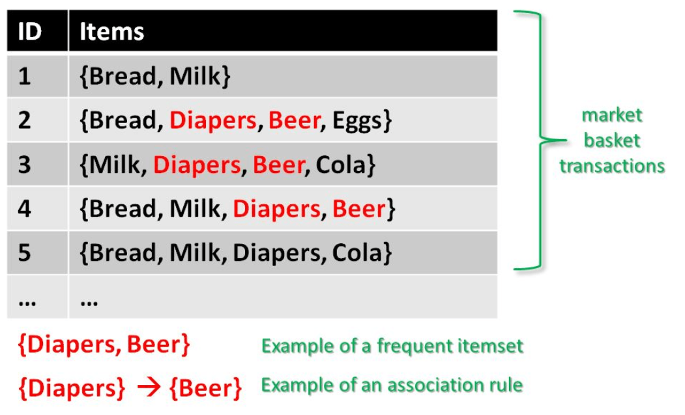
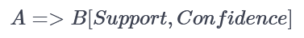
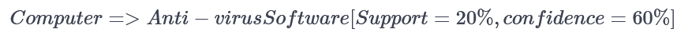
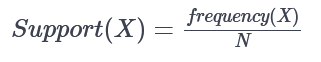
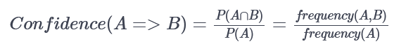
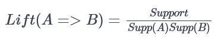
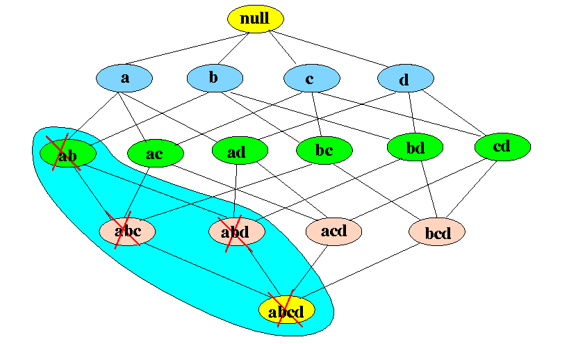
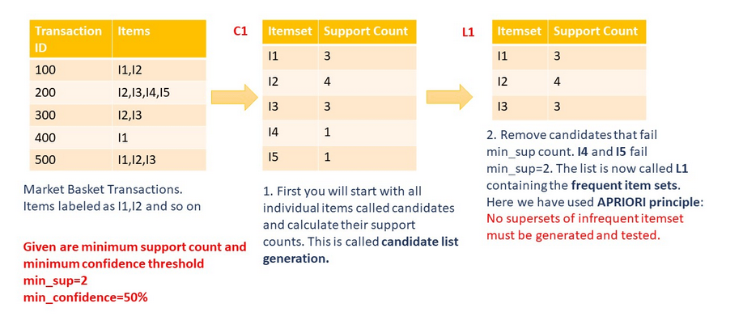
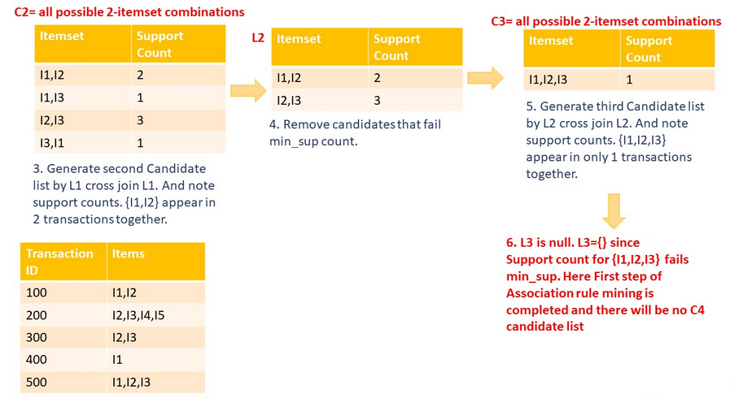
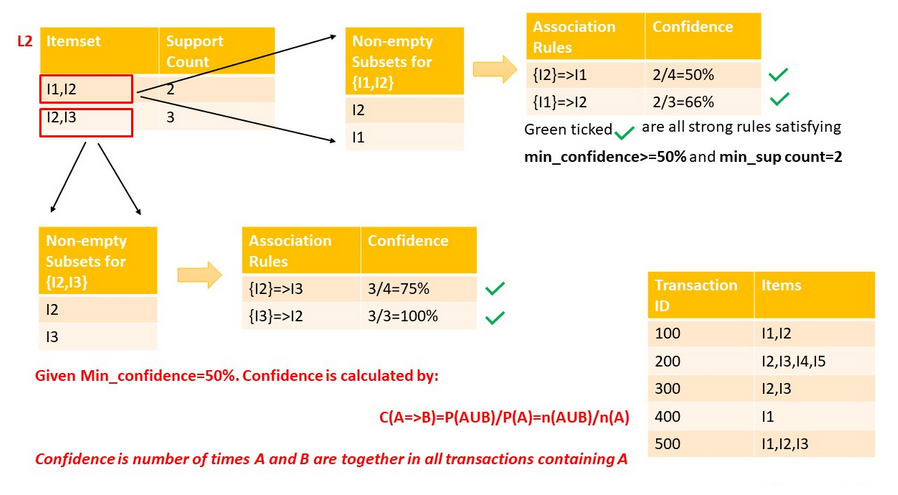

Association Rule Mining is used when you want to find an association between different objects in a set, find frequent patterns in any information repository. It generates a set of rules called **Association Rules**. In simple words, it gives you output as rules in form **if this then that**.

Consider the following example:

{width="900"} We have a set of transaction data, numbered 1 to 5. Each transaction shows items bought in that transaction. You can see that *Diaper is bought with Beer* in three transactions. Similarly, *Bread is bought with milk* in three transactions making them both frequent item sets. Association rules are given in the form as below:  The part before =\> is referred to as *if (Antecedent)* and the part after =\> is referred to as *then (Consequent)*.

Where A and B are sets of items in the transaction data. *A and B are disjoint sets*.

For example. if we have this rule:



1.  20% transaction show Anti-virus software is bought with purchase of a Computer;

2.  60% of customers who purchase Anti-virus software is bought with purchase of a Computer

Basic concepts of Association Rule Mining:

1.  **Itemset:** Collection of one or more items. K-item-set means a set of k items.

2.  **Support Count:** Frequency of occurrence of an item-set.

3.  **Support (s):** Fraction of transactions that contain the item-set 'X'.

    

4.  **Confidence (c):** For a rule A=\>B Confidence shows the percentage in which B is with A. The number of transactions with both A and B divided by the total number of transactions having A.

5.  **Lift:** Lift gives the correlation between A and B in the rule A=\>B. Correlation shows how one item-set A effects the item-set B.

    

    -   If the rule had a lift of 1,then A and B are independent and no rule can be derived from them.

    -   If the lift is \> 1, then A and B are dependent on each other, and the degree of which is given by ift value.

    -   If the lift is \< 1, then presence of A will have negative effect on B.

### APRIORI Algorithm

Association Rule Mining is viewed as a two-step approach:

1.  **Frequent Itemset Generation:** find all frequent item-sets with support \>= pre-determined min_support count.

2.  **Rule Generation:** list all Association Rules from frequent item-sets. Calculate Support and Confidence for all rules.

**Frequent Itemset Generation** is the most computationally expensive step because it requires a full database scan.

For this APRIORI Algorithm is used. It states:

*"Any subset of a frequent itemset must also be frequent. In other words, no superset of an infrequent itemset must be generated or tested".*

The following figure shows how much APRIORI helps to reduce the number of sets to be generated:

 If item-set *{a,b}* is infrequent then we do not need to take into account all its super-sets.

Let's understand this by an example. In the following example, you will see why APRIORI is an effective algorithm and also generate strong association rules step by step.



Here APRIORI plays its role and helps reduce the number of the Candidate list, and useful rules are generated at the end. In the following steps, you will see how we reach the end of Frequent Itemset generation, that is the first step of Association rule mining.

Next step will be to list all frequent itemsets. You will take the last non-empty Frequent Itemset, which in this example is **L2={I1, I2},{I2, I3}**. Then make all non-empty subsets of the item-sets present in that Frequent Item-set List. Follow along as shown in below illustration:



You can see above there are four strong rules. For example, take I2=\>I3 having confidence equal to *75%* tells that 75% of people who bought **I2** also bought **I3**.

Let's get on to the code.

### Implementing MBA/Association Rule Mining using R

We will use the dataset **df_join** that contains design and test smells associated to classes of several projects, on more releases.

##### Some Attribute Information

-   *NameTag*: the name of project's version.

-   *HashCommit*: the hash of the commit associated to that release.

-   *Date*: the date in which the release is committed.

-   *Project Name*: the name of the project.

-   *Package Name*: package that contains the class having design/test smells.

-   *Type Name*: the class having design/test smells.

-   *Cause of the smell*: a description of the cause of that design smell.

-   *ClassName*: the concatenation between *Package Name* and *Type Name*.

-   *Test suite:* the class of test associated to production code.

-   *Test smells:* what test smells betweenar1, et1, it1, gf1, se1, mg1, ro1 presents that class of test.

-   *Smells:* contains an union between the design and test smells affecting that class.

```{r}
#install and load package arules
#install.packages("arules")
library(arules)
#install and load arulesViz
#install.packages("arulesViz")
library(arulesViz)
#install and load tidyverse
#install.packages("tidyverse")
library(tidyverse)
#install and load readxml
#install.packages("readxml")
library(readxl)
#install and load knitr
#install.packages("knitr")
library(knitr)
#load ggplot2 as it comes in tidyverse
library(ggplot2)
#install and load lubridate
#install.packages("lubridate")
library(lubridate)
#install and load plyr
#install.packages("plyr")
library(plyr)
library(dplyr)
```

Use `read_csv(path to file)` to read the dataset **df_join**.

```{r}
df_join <- read.csv("df_join.csv")
df_join
```

Before applying Association Rule mining, we need to convert *dataframe* into transaction data so that all smells that appears together in one class are in one row.

We can group smells using `NameClass`. We need this grouping and apply a function on it and store the output in another dataframe. This can be done by [`ddply`](https://www.rdocumentation.org/packages/plyr/versions/1.8.4/topics/ddply).

The following lines of code will combine all set of smells from one `ClassName` as one row. Each set of smells is separated by `,`.

```{r}
library(plyr)
#ddply(dataframe, variables_to_be_used_to_split_data_frame, function_to_be_applied)
transactionData <- ddply(df_join,c("ClassName"),
                      function(df_join)paste(df_join$Smells,
                       collapse = ","))
#The R function paste() concatenates vectors to character and separated results using collapse=[any optional charcater string ]. Here ',' is used
```

Next, as *ClassName* will not be of any use in the rule mining, we can set it to `NULL`.

```{r}
transactionData$ClassName <- NULL
```

This format for transaction data is called the **basket** format. Next, you have to store this transaction data into a **.csv** (Comma Separated Values) file. For this, `write.csv()`.

```{r}
write.csv(transactionData,"transactions.csv", quote = FALSE, row.names = FALSE)
```

We load this transaction data into an object of the transaction class. This is done by using the R function [`read.transactions`](https://www.rdocumentation.org/packages/arules/versions/1.6-1/topics/read.transactions) of the `arules` package.

The following line of code will take transaction data file `transactions.csv` which is in **basket** format and convert it into an object of the transaction class.

```{r}
tr <- read.transactions('transactions.csv', format = 'basket', sep=',')
tr
```

```{r}
summary(tr)
```

The `summary(tr)` is a very useful command that gives us information about our transaction object. Let's take a look at what the above output says:

-   There are **1269 transactions (rows) and 223 items (columns)**. Note that *223* are the smells involved in the dataset and *1269* transactions are collections of these items.

-   **Density** tells the percentage of non-zero cells in a sparse matrix. You can say it as the total number of smells that are detected divided by a possible number of smells in that matrix. You can calculate how many items were purchased by using density: *1269x223x0.006979119=1974.96.*

You can generate an `itemFrequencyPlot` to create an item Frequency Bar Plot to view the distribution of items.

```{r}
# Create an item frequency plot for the top 20 items
if (!require("RColorBrewer")) {
  # install color package of R
install.packages("RColorBrewer")
#include library RColorBrewer
library(RColorBrewer)
}
itemFrequencyPlot(tr,topN=20,type="absolute",col=brewer.pal(8,'Pastel2'), main="Absolute Item Frequency Plot")
```

In `itemFrequencyPlot(tr,topN=20,type="absolute")` first argument is the transaction object to be plotted that is `tr`. `topN` allows you to plot top N highest frequency items. `type` can be `type="absolute"` or `type="relative"`. If absolute it will plot numeric frequencies of each item independently. If relative it will plot how many times these items have appeared as compared to others.

```{r}
itemFrequencyPlot(tr,topN=20,type="relative",col=brewer.pal(8,'Pastel2'),main="Relative Item Frequency Plot")
```

#### Generating Rules!

### Design-Test smells

Next step is to mine the rules using the APRIORI algorithm. The function `apriori()` is from package `arules`.

```{r}
design_smells = c('Deficient Encapsulation', 'Unutilized Abstraction', 'Feature Envy',  'Broken Hierarchy', 'Broken Modularization', 'Insufficient Modularization', 'Wide Hierarchy', 'Unnecessary Abstraction', 'Multifaceted Abstraction', 'Cyclically-dependent Modularization','Cyclic Hierarchy', 'Rebellious Hierarchy')

test_smells = c("ar1", "et1", "it1",  "gf1", "se1", "mg1", "ro1")
```

```{r}
# Min Support as 0.001, confidence as 0.8.
association.rules <- apriori(tr, parameter = list(supp=0.001, conf=0.8, minlen=2, maxlen=2),
                             appearance = list(lhs=design_smells, rhs=test_smells))
```

The `apriori` will take `tr` as the transaction object on which mining is to be applied. `parameter` will allow you to set min_sup and min_confidence. The default values for `parameter` are minimum support of 0.1, the minimum confidence of 0.8, maximum of 2 items (maxlen), minimum of 2 items (minlen). With `appearance` we specified the **LHS (IF part)** with the array of design_smell and **RHS (THEN part)** with the test_smell.

```{r}
summary(association.rules)
```

`summary(association.rules)` shows the following:

-   **Parameter Specification:** min_sup=0.001 and min_confidence=0.8 values with 2 items as max of items in a rule and 2 items as min of items in a rule.

-   **Total number of rules:** The set of *9* rules

-   **Summary of Quality measures:** Min and max values for Support, Confidence and, Lift.

-   **Information used for creating rules:** The data, support, and confidence we provided to the algorithm.

Since there are 9 rules, we don't have to filter only the top 10:

```{r}
inspect(association.rules)
#inspect(association.rules[1:10])
```

Using the above output, you can make analysis such as:

-   Classes which have design smell 'Cyclic Hierarchy' will have the test smell 'et1' with support of 0.01 and confidence of 0.81.

-   Classes which have design smell 'Multifaceted Abstraction' will have the test smell 'ar1' with support of 0.0149 and confidence of 1.

-   Classes which have design smell 'Feature Envy' will have the test smell 'et1' with support of 0.06 and confidence of 0.89.

-   Classes which have design smell 'Feature Envy' will have the test smell 'ar1' with support of 0.059 and confidence of 0.87.

    #### Visualize Association Rules

    Since there will be hundreds or thousands of rules generated based on data, you need a couple of ways to visualize these association rules.

    #### Scatter-Plot

    A straight-forward visualization of association rules is to use a scatter plot using `plot()` of the `arulesViz` package. It uses *Support* and *Confidence* on the axes. In addition, third measure *Lift* is used by default to color (grey levels) of the points.

    ```{r}
    # Filter rules with confidence greater than 0.4 or 40%
    subRules<-association.rules[quality(association.rules)$confidence>0.4]
    #Plot SubRules
    plot(subRules)
    ```

    The above plot shows that rules with high lift have low support. You can use the following options for the plot:

    ```{r}
    plot(subRules,method="two-key plot")
    ```

    The **two-key plot** uses support and confidence on x and y-axis respectively. It uses *order* for coloring. The order is the number of items in the rule.

    **Graph-Based Visualizations**

    Graph-based techniques visualize association rules using vertices and edges where vertices are labeled with item names, and item sets or rules are represented as a second set of vertices. Items are connected with item-sets/rules using directed arrows. Arrows pointing from items to rule vertices indicate LHS items and an arrow from a rule to an item indicates the RHS. The size and color of vertices often represent interest measures.

    Graph plots are a great way to visualize rules but tend to become congested as the number of rules increases. So it is better to visualize less number of rules with graph-based visualizations.

    Let's select 9 rules from `subRules` having the highest confidence.

    ```{r}
    top10subRules <- head(subRules, n = 9, by = "confidence")
    ```

    Now, plot an interactive graph:

    **Note:** You can make all your plots interactive using `engine=htmlwidget` parameter in `plot`

    ```{r}
    plot(top10subRules, method = "graph",  engine = "htmlwidget")
    ```

    #### Individual Rule Representation

    This representation is also called as **Parallel Coordinates Plot**.

    As mentioned above, the RHS is the Consequent; the positions are in the LHS where 2 is the most recent addition to our basket and 1 is the item we previously had.

    ```{r}
    # Filter top 9 rules with highest lift
    subRules2<-head(subRules, n=9, by="lift")
    plot(subRules2, method="paracoord")
    ```

    It shows that when the class has 'Multifaceted Abstraction', with high probability It will also have 'ar1'.

    ### Design-Design smells

Next step is to run APRIORI algorithm with design-design smell:

```{r}
# Min Support as 0.001, confidence as 0.8.
association.rules <- apriori(tr, parameter = list(supp=0.001, conf=0.8, minlen=2, maxlen=4), appearance = list(both=design_smells))
                      
```

The `apriori` will take `tr` as the transaction object on which mining is to be applied. `parameter` will allow you to set min_sup and min_confidence. The default values for `parameter` are minimum support of 0.1, the minimum confidence of 0.8, maximum of 4 items (maxlen), becouse with maxlen=2 there were 0 rules, minimum of 2 items (minlen). With `appearance` we specified the **both** parameter with the array of design_smell.

```{r}
summary(association.rules)
```

We obtained 7 rules that are showed here:

```{r}
inspect(association.rules)
#inspect(association.rules[1:10])
```

Using the above output, you can make analysis such as:

-   Classes which have design smells 'Broken Modularization' and 'Unnecessary Abstraction' will have the design smell 'Unutilized Abstraction' with support of 0.0039 and confidence of 1.

-   Classes which have design smell 'Feature Envy' and 'Unnecessary Abstraction' will have the design smell 'Unutilized Abstraction' with support of 0.0023 and confidence of 1.

    #### Visualize Association Rules

    Since there will be hundreds or thousands of rules generated based on data, you need a couple of ways to visualize these association rules.

    #### Scatter-Plot

    A straight-forward visualization of association rules is to use a scatter plot using `plot()` of the `arulesViz` package. It uses *Support* and *Confidence* on the axes. In addition, third measure *Lift* is used by default to color (grey levels) of the points.

    ```{r}
    # Filter rules with confidence greater than 0.4 or 40%
    subRules<-association.rules[quality(association.rules)$confidence>0.4]
    #Plot SubRules
    plot(subRules)
    ```

    The above plot shows that rules with high lift have low support. You can use the following options for the plot:

    ```{r}
    plot(subRules,method="two-key plot")
    ```

    The **two-key plot** uses support and confidence on x and y-axis respectively. It uses *order* for coloring. The order is the number of items in the rule.

    **Graph-Based Visualizations**

    Graph-based techniques visualize association rules using vertices and edges where vertices are labeled with item names, and item sets or rules are represented as a second set of vertices. Items are connected with item-sets/rules using directed arrows. Arrows pointing from items to rule vertices indicate LHS items and an arrow from a rule to an item indicates the RHS. The size and color of vertices often represent interest measures.

    Graph plots are a great way to visualize rules but tend to become congested as the number of rules increases. So it is better to visualize less number of rules with graph-based visualizations.

    Let's select 7 rules from `subRules` having the highest confidence.

    ```{r}
    top10subRules <- head(subRules, n = 7, by = "confidence")
    ```

    Now, plot an interactive graph:

    **Note:** You can make all your plots interactive using `engine=htmlwidget` parameter in `plot`

    ```{r}
    plot(top10subRules, method = "graph",  engine = "htmlwidget")
    ```

    #### Individual Rule Representation

    This representation is also called as **Parallel Coordinates Plot**.

    As mentioned above, the RHS is the Consequent; the positions are in the LHS where 2 is the most recent addition to our basket and 1 is the item we previously had.

    ```{r}
    # Filter top 7 rules with highest lift
    subRules2<-head(subRules, n=7, by="lift")
    plot(subRules2, method="paracoord")
    ```

    It shows that when the class has 'Broken Modularization', 'Deficient Encapsulation', 'Unutilized Abstraction' with high probability It will also have 'Unnecessary Abstraction'.

    ### Test-Test smells

Next step is to run APRIORI algorithm with test-test smell:

```{r}
# Min Support as 0.001, confidence as 0.8.
association.rules <- apriori(tr, parameter = list(supp=0.001, conf=0.8, minlen=2, maxlen=2), appearance = list(both=test_smells))
```

The `apriori` will take `tr` as the transaction object on which mining is to be applied. `parameter` will allow you to set min_sup and min_confidence. The default values for `parameter` are minimum support of 0.1, the minimum confidence of 0.8, maximum of 2 items (maxlen), minimum of 2 items (minlen). With `appearance` we specified the **both** parameter with the array of test_smell.

```{r}
summary(association.rules)
```

We filtered the first 10 rules that are showed here:

```{r}
#inspect(association.rules)
inspect(association.rules[1:10])
```

Using the above output, you can make analysis such as:

-   Classes which have test smell 'ro1' will have the test smell 'mg1' with support of 0.0126 and confidence of 0.8.

-   Classes which have test smell 'ro1' will have the test smell 'et1' with support of 0.0141 and confidence of 0.9.

#### Visualize Association Rules

Since there will be hundreds or thousands of rules generated based on data, you need a couple of ways to visualize these association rules.

#### Scatter-Plot

A straight-forward visualization of association rules is to use a scatter plot using `plot()` of the `arulesViz` package. It uses *Support* and *Confidence* on the axes. In addition, third measure *Lift* is used by default to color (grey levels) of the points.

```{r}
# Filter rules with confidence greater than 0.4 or 40%
subRules<-association.rules[quality(association.rules)$confidence>0.4]
#Plot SubRules
plot(subRules)
```

The above plot shows that rules with high lift have low support. You can use the following options for the plot:

```{r}
plot(subRules,method="two-key plot")
```

The **two-key plot** uses support and confidence on x and y-axis respectively. It uses *order* for coloring. The order is the number of items in the rule.

**Graph-Based Visualizations**

Graph-based techniques visualize association rules using vertices and edges where vertices are labeled with item names, and item sets or rules are represented as a second set of vertices. Items are connected with item-sets/rules using directed arrows. Arrows pointing from items to rule vertices indicate LHS items and an arrow from a rule to an item indicates the RHS. The size and color of vertices often represent interest measures.

Graph plots are a great way to visualize rules but tend to become congested as the number of rules increases. So it is better to visualize less number of rules with graph-based visualizations.

Let's select 10 rules from `subRules` having the highest confidence.

```{r}
top10subRules <- head(subRules, n = 10, by = "confidence")
```

Now, plot an interactive graph:

**Note:** You can make all your plots interactive using `engine=htmlwidget` parameter in `plot`

```{r}
plot(top10subRules, method = "graph",  engine = "htmlwidget")
```

#### Individual Rule Representation

This representation is also called as **Parallel Coordinates Plot**.

As mentioned above, the RHS is the Consequent; the positions are in the LHS where 2 is the most recent addition to our basket and 1 is the item we previously had.

```{r}
# Filter top 20 rules with highest lift
subRules2<-head(subRules, n=20, by="lift")
plot(subRules2, method="paracoord")
```

It shows that when the class has 'ro1', with high probability It will also have 'mg1'.
